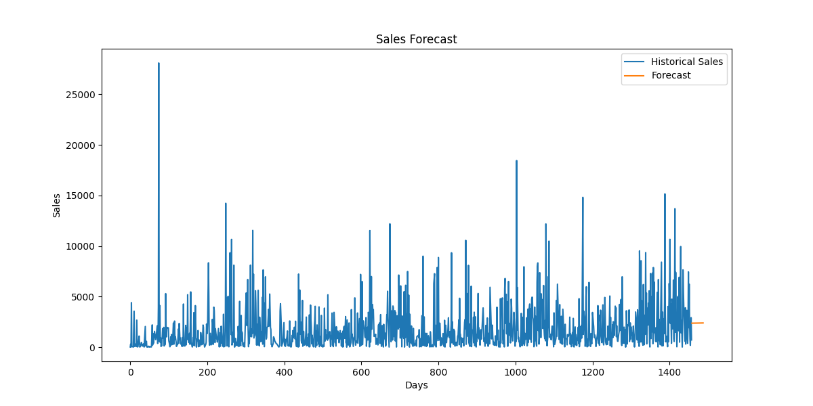

# FUTURE_ML_01
# Sales & Demand Forecasting for Businesses

## 📌 Project Overview

Sales forecasting is one of the most important applications of Machine Learning in modern businesses. Accurate forecasts help organizations make informed decisions regarding inventory management, staffing, budgeting, and future business planning.

This project develops a Sales & Demand Forecasting System using historical retail sales data. The model analyzes past sales trends and predicts future sales, enabling businesses to make data-driven decisions.

---

## 🎯 Objective

The primary objective of this project is to:

- Analyze historical sales data
- Identify sales trends and patterns
- Build a Machine Learning forecasting model
- Predict future sales demand
- Visualize forecasts in a business-friendly manner
- Provide insights that support business planning

---

## 🏢 Business Problem

Businesses often face challenges such as:

- Overstocking products
- Inventory shortages
- Poor revenue planning
- Inefficient resource allocation

A reliable forecasting system helps organizations anticipate future demand and optimize operational decisions.

---

## 📊 Dataset Information

### Dataset Used
**Superstore Sales Dataset**

The dataset contains:

- Order Details
- Customer Information
- Product Information
- Sales Data
- Profit Data
- Regional Information

### Dataset Statistics

| Feature | Value |
|----------|---------|
| Total Records | 9,994 |
| Features | 21 |
| Data Type | Retail Sales Data |
| Time-Based Data | Yes |

---

## 🛠 Technologies Used

### Programming Language

- Python

### Development Environment

- VS Code
- Jupyter Notebook
- GitHub

### Python Libraries

- Pandas
- NumPy
- Scikit-learn
- Matplotlib

---

## 📂 Project Structure

```text
FUTURE_ML_01
│
├── data
│   └── sales.csv
│
├── notebooks
│   └── sales_forecasting.ipynb
│
├── outputs
│   └── forecast_plot.png
│
├── screenshots
│   ├── dataset_loaded.png
│   ├── model_trained.png
│   └── forecast_graph.png
│
├── src
│   ├── preprocess.py
│   ├── train.py
│   └── predict.py
│
├── requirements.txt
├── README.md
└── app.py
```

---

## ⚙️ Project Workflow

### 1. Data Collection

Imported the Superstore Sales Dataset containing historical sales transactions.

---

### 2. Data Cleaning

Performed data preprocessing including:

- Missing value inspection
- Duplicate record removal
- Data type conversion
- Date formatting

---

### 3. Feature Engineering

Created time-based features from the order date:

- Date Conversion
- Day Index
- Trend Representation

These features help the model understand sales progression over time.

---

### 4. Sales Aggregation

Grouped sales records by date to create a daily sales forecasting dataset.

Example:

| Order Date | Sales |
|------------|--------|
| 2014-01-03 | Value |
| 2014-01-04 | Value |

---

### 5. Model Development

A **Linear Regression Model** was trained using historical sales trends.

Model Inputs:

- Day Number

Target Variable:

- Sales

---

### 6. Model Training

The dataset was divided into:

- Training Data (80%)
- Testing Data (20%)

The model learned historical sales patterns and generated future predictions.

---

### 7. Forecast Generation

Generated forecasts for future sales based on historical trends.

The forecasting process enables businesses to estimate future demand and prepare accordingly.

---

### 8. Visualization

Created forecast visualizations using Matplotlib.

Visualization includes:

- Historical Sales Trend
- Predicted Future Sales
- Business-Friendly Forecast Graph

---

## 📈 Results

### Forecast Output

The model successfully generated future sales predictions based on historical data patterns.

### Business Insights

The forecast can help businesses:

✅ Plan Inventory

✅ Estimate Future Revenue

✅ Reduce Overstocking

✅ Prevent Stock-Out Situations

✅ Improve Operational Planning

✅ Support Strategic Decision Making

---

## 📊 Model Performance

Add your actual values here:

| Metric | Value |
|----------|----------|
| Mean Absolute Error (MAE) | YOUR_MAE_VALUE |
| Mean Squared Error (MSE) | YOUR_MSE_VALUE |

## 📈 Forecast Visualization



## 🚀 Future Improvements

This project can be enhanced by implementing:

- ARIMA Forecasting
- Facebook Prophet
- LSTM Neural Networks
- XGBoost Regression
- Interactive Dashboards
- Real-Time Forecasting
- Cloud Deployment

---

## 💡 Learning Outcomes

Through this project, I learned:

- Data Cleaning and Preparation
- Time Series Feature Engineering
- Sales Forecasting Techniques
- Machine Learning Model Development
- Data Visualization
- Business-Oriented Analytics
- GitHub Project Management

---

## 🎓 Internship Task Information

**Internship:** Future Interns

**Track:** Machine Learning (ML)

**Task Number:** 01

**Task Title:** Sales & Demand Forecasting for Businesses

**Repository Name:** FUTURE_ML_01

---

## 👩‍💻 Author

### SAI CHARITHA AMARNENI

B.Tech – Artificial Intelligence & Machine Learning

Future Interns – Machine Learning Internship 2026

---

## ⭐ Conclusion

This project demonstrates how Machine Learning can be applied to real-world business forecasting problems. By analyzing historical sales data and generating future predictions, organizations can make smarter decisions, optimize resources, and improve overall business performance.